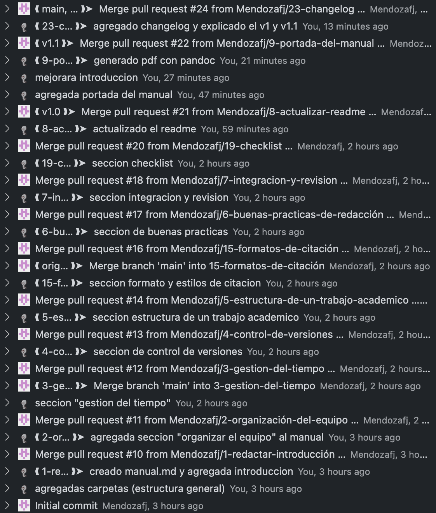
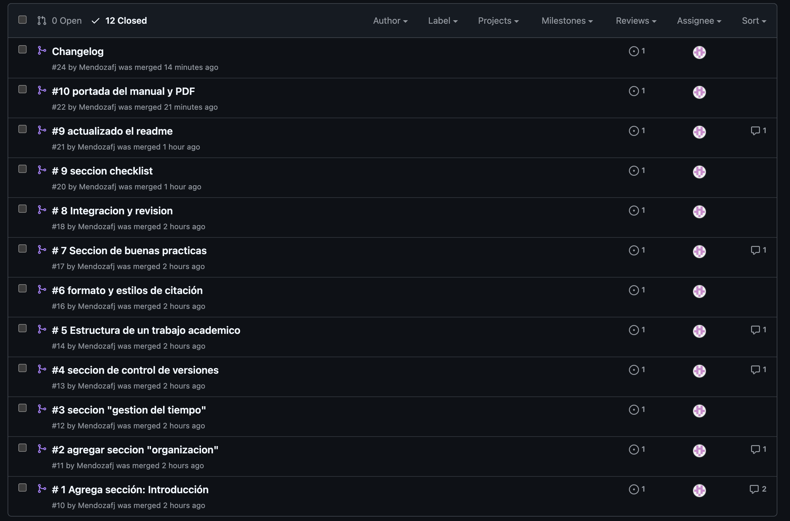
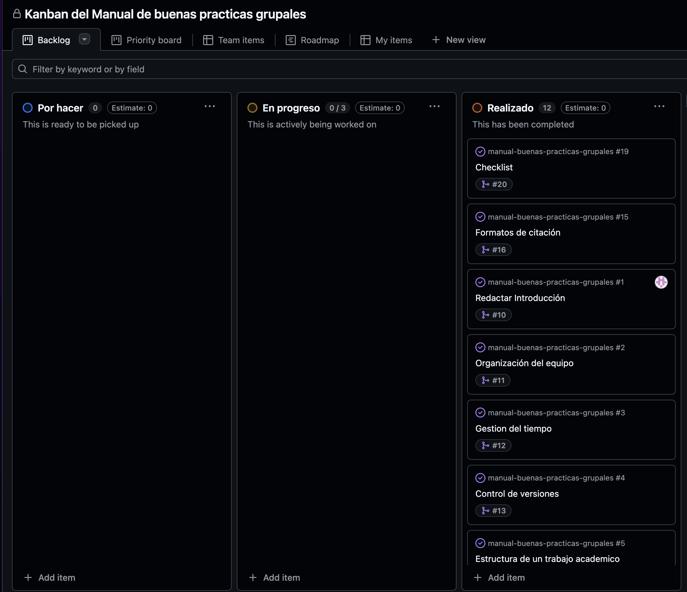
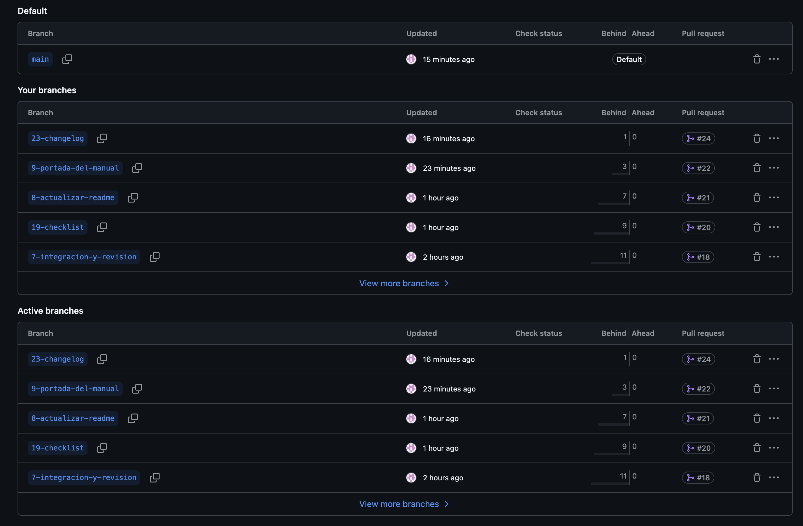
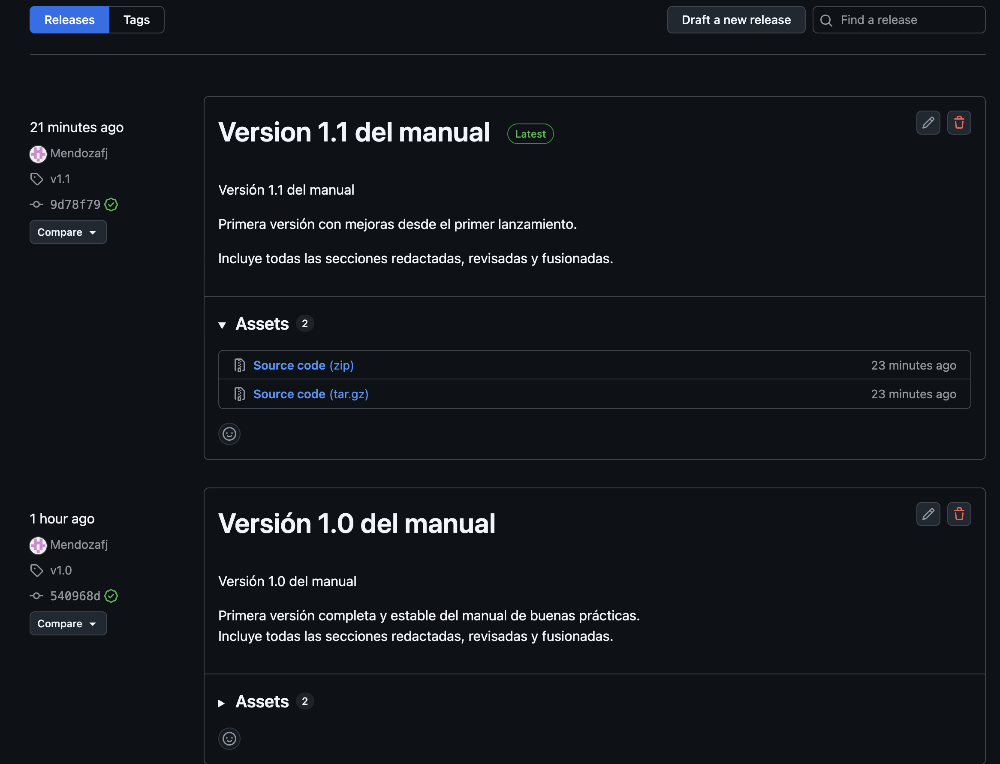

# Evidencias del Uso de GitHub para el Proyecto “Manual de Buenas Prácticas para Trabajos Universitarios en Grupo”

**Asignatura:** Proyecto de Sistema  
**Tema:** Uso de Git y GitHub en la elaboración de trabajos académicos en grupo  
**Autor:** Francisco Salcedo
**Profesor:** Edgardo Paolini
**Institución:** Universidad Valle Del Momboy
**Fecha:** 20/11/2025

---

## Índice

1. Introducción  
2. Evidencias del historial del repositorio  
   2.1. Lista de commits  
   2.2. Pull Requests cerrados  
   2.3. Issues creadas y finalizadas  
   2.4. Ramas utilizadas  
   2.5. Releases y tags  
3. Evidencias del tablero de proyecto  
   3.1. Vista general del tablero  
   3.2. Ejemplo de tarjeta (issue) vinculada y finalizada  
4. Conclusiones  

---

## 1. Introducción

El presente documento reúne las evidencias del uso de Git y GitHub en el desarrollo del “Manual de buenas prácticas para trabajos universitarios en grupo”.  
El objetivo de esta sección de la entrega final es demostrar que las distintas funcionalidades de GitHub fueron utilizadas de manera adecuada: trabajo por ramas, gestión de tareas mediante issues, uso del tablero de proyecto, revisiones mediante Pull Requests y publicación de versiones oficiales (releases).

Cada evidencia se presenta en forma de captura de pantalla acompañada de una breve descripción, con el fin de facilitar la verificación del proceso seguido durante la realización del proyecto.

---

## 2. Evidencias del historial del repositorio

### 2.1. Lista de commits

A continuación se muestra la captura correspondiente al historial de commits del repositorio, donde se refleja la progresión del trabajo, la integración de cada sección del manual y las actualizaciones realizadas durante las versiones del documento.

**Captura:**  

**Descripción:**  
En esta imagen se observa el registro cronológico de los commits realizados, incluyendo aquellos asociados a las secciones del manual, la portada, la introducción y la generación del archivo PDF final. El historial demuestra un proceso ordenado y dividido en etapas claras.

---

### 2.2. Pull Requests cerrados

**Captura:**  

**Descripción:**  
Se presenta la lista de Pull Requests utilizados para fusionar cada rama con la rama principal. Cada PR corresponde a una sección del manual o a una modificación relevante, siguiendo un flujo de trabajo coherente.

---

### 2.3. Issues creadas y finalizadas

**Captura:**  

**Descripción:**  
La captura muestra todas las issues creadas para este proyecto, cada una asociada a una tarea específica. Todas las issues se encuentran cerradas, lo que indica que fueron atendidas y completadas a lo largo del proceso de desarrollo.

---

### 2.4. Ramas utilizadas

**Captura:**  

**Descripción:**  
Aquí se muestran las ramas creadas durante el proyecto, incluyendo aquellas dedicadas a secciones del manual, a la portada, a las referencias y al texto introductorio del PDF. Las ramas integradas reflejan un uso adecuado del control de versiones.

---

### 2.5. Releases y tags

**Captura:**  

**Descripción:**  
Esta captura evidencia la creación de las versiones v1.0 y v1.1 del manual, cada una con su descripción y archivos asociados. La publicación de releases confirma el uso adecuado del versionado semántico y la finalización de entregas formales.

---

## 3. Evidencias del tablero de proyecto

### Ejemplo de tarjeta (issue) vinculada

**Captura:**  

**Descripción:**  
La captura muestra el contenido de una tarjeta del tablero, incluyendo su descripción, la referencia al Pull Request correspondiente y el estado final de la issue. Esto demuestra cómo se gestionó cada tarea mediante GitHub Projects.

---

## 4. Conclusiones

El conjunto de evidencias presentadas permite verificar que el proyecto se desarrolló siguiendo un flujo de trabajo completo basado en Git y GitHub. Se utilizaron issues, ramas independientes, Pull Requests, revisiones, un tablero de proyecto y releases con versionado claro.

El proceso aplicado no solo permitió organizar el desarrollo del manual de forma estructurada, sino que también demuestra el dominio de herramientas fundamentales para el trabajo colaborativo y la gestión de contenido digital.

